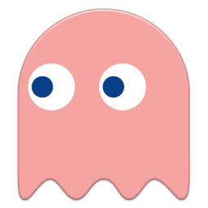

# Pac-man Game

This is a Pac-man game coded in python, which provides ai using reinforcement learning and greedy methods.

The user opeartions api are also in the plan.

The game map consists of 25*23 grids.

## Table of Contents

* [Rule](#rule)
* [Target](#target)
  * [Pac-man](#pac-man)
  * [Ghosts](#ghosts)
* [Implementation](#implementation)   
  * [Methods For Shorest Path Query](#methods-for-shortest-path-query)
  * [Strategy For Pac-man & Ghost](#strategy-for-pac-man--ghost)
    * [Only One Ghost](#only-one-ghost)
    * [Two Ghost](#two-ghost)

## Rule

* The Pac-man Game has one Pac-man and some Ghosts. In this game we set two target for Pac-man, escaping or eating all dots.
* Whether the boundary can be crossed can be set in setting.py.

## Target

> The target can be set in settings.py.

#### Pac-man

* Escape from Ghosts
* Eat all the beans (TODO)

#### Ghosts

* Catch Pac-man

## Implementation

### Methods For Shortest Path Query

The method for shortest path query can be set in settings.py.
* Breadth First Search
* Depth First Search
* Dijkstra (TODO)

### Strategy For Pac-man & Ghost

#### Only One Ghost

* Greedy: Take the action to shorten/lengthen the distance between Pac-man and Ghost.
* Reinforcement learning (TODO)

#### Two Ghost

* TODO