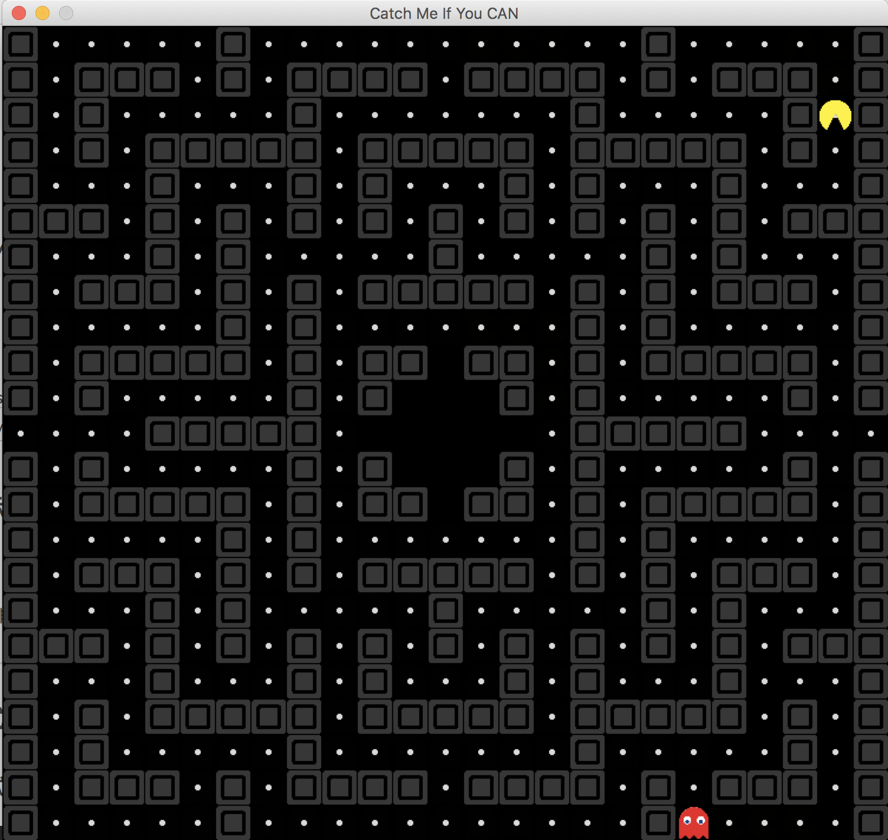

# Pac-man Game

This is a Pac-man game coded in python, which provides ai using reinforcement learning and greedy methods.

The user opeartions api are also in the plan.

The game map consists of 25*23 grids.

[TOC]

## Implementation
### Target
####Pac-man

* Escape from Ghosts
* Eat all the beans (TODO)
####Ghosts

* Catch Pac-man
### Methods For Shortest Path Query
The method for shortest path query can be set in settings.py.
* Breadth First Search
* Depth First Search
* Dijkstra (TODO)
### Strategy For Pac-man & Ghost
####Only One Ghost
* Greedy: Take the action to shorten/lengthen the distance between Pac-man and Ghost.
* Reinforcement learning (TODO)
####Two Ghost
* TODO